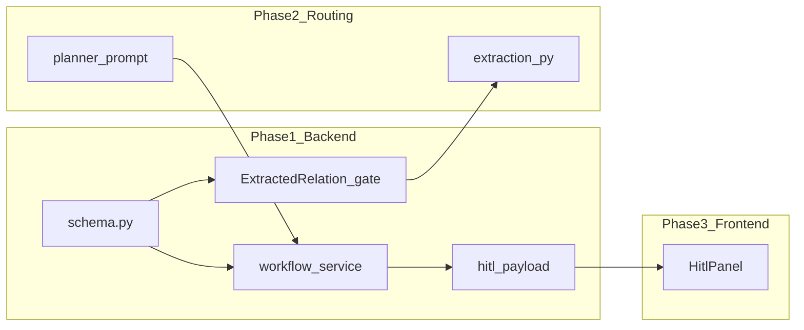

# HITL 與產品路線（合併計畫）

## 現況摘要（與規格的落差）

- [`HitlStateInjectionRequest`](backend/app/domain/schema.py) 目前僅有 `mutations` / `chapter_hard_rules` / `resume_from`；尚無節奏煞車與未來錨點欄位。
- [`HitlContextPruneRequest`](backend/app/domain/schema.py) 仍允許覆寫多段 context 字串；[`apply_hitl_context_prune`](backend/app/services/workflow/service.py) 會直接寫入 state。規格改為僅 `graph_rag_context_tier` 由後端組裝降級。
- [`graph_rag.py`](backend/app/services/workflow/nodes/graph_rag.py) 的 `graph_rag_context_tier` 語意為「組裝迴圈起始 tier + hop／截斷上限」，且數值越大越寬鬆。規格 0=完整、2=最激進瘦身需在邊界做明確映射（`HitlContextPruneRequest` 產品語意 → 內部 `run_graph_rag` 參數）。
- [`store_anchors`](backend/app/repositories/sqlite/story_repository.py) 會全量刪除再插入；HITL 追加錨點須 `list_anchors` → 合併新 `StateAnchor` → `store_anchors`。
- [`HitlExtractionHintsRequest`](backend/app/domain/schema.py) 目前由 [`/hitl/extraction-hints`](backend/app/api/routes.py) 在暫停時套用；規格改到 [`ChapterRunRequest`](backend/app/domain/schema.py) + [`start_run_chapter`](backend/app/services/workflow/service.py)。

**程式庫對照（避免實作時找錯檔）：** 抽取管線的 `_validation_gate` 實際在 [`backend/app/services/workflow/extraction.py`](backend/app/services/workflow/extraction.py)，不在 `graph_rag.py`。計畫以 `extraction.py` 為準；若文件曾寫 `graph_rag.py`，視為筆誤。

---

## 階段一：後端 Schema、資料清洗與圖譜防呆

### 1. `HitlStateInjectionRequest` 重構

- 在 [`schema.py`](backend/app/domain/schema.py) 增加：`this_chapter_pacing_limit`、`future_anchor_title`、`future_anchor_description`、`chapters_to_delay`（Optional，`ge=0`）。
- 在 [`AgentWorkflowState`](backend/app/domain/state.py) / [`normalize_workflow_state`](backend/app/domain/state.py) 增加可選 pacing 欄位供 Planner 讀取。
- 在 [`apply_hitl_state_injection`](backend/app/services/workflow/service.py)：寫入 pacing；非空未來錨點時計算 `target_chapter`、`anchor_id`、`StateAnchor`（`volume_id` 由 `list_volumes` 對本章落在區間決定）、`list_anchors` 合併後 `store_anchors`，並 `_refresh_unachieved_anchors`。`chapters_to_delay is None` 時行為：預設 `0` 並在 API 描述說明，或寫入 `plan_warnings`（擇一寫入計畫實作時定案）。

### 2. `HitlContextPruneRequest` 重構

- 移除手動 context 字串欄位；必填 `graph_rag_context_tier`（0–2 產品語意）；`apply_hitl_context_prune` 只設定映射後的 tier、清零 overflow、`resume_from = "graph_rag"`。

### 3. BFF：`HitlContextPayload`

- 新增模型與 `build_hitl_context_payload`（建議 [`backend/app/services/workflow/hitl_payload.py`](backend/app/services/workflow/hitl_payload.py)）；[`get_workflow`](backend/app/services/workflow/service.py) 在 `WAITING_HITL` 時附加 `hitl_context`。

### 4. 圖譜防呆清洗器（原清單「Pydantic Validators」）

**目標：** 抽取／關係進圖前的一致化與捨棄非法資料。

#### 4a. [`ExtractedRelation`](backend/app/domain/schema.py)（`known_by` / `holder`）

- **現況：** `ExtractedRelation` 目前無 `known_by`、`holder`；兩者定義在 [`GraphEdge`](backend/app/domain/schema.py)。
- **實作：** 在 `ExtractedRelation` 上新增可選欄位 `known_by: list[str]`、`holder: list[str]`（預設空），與下游轉 `GraphEdge` 時對齊；並新增 `@field_validator("known_by", "holder", mode="before")`：以正則過濾，**剔除不含底線 `_` 的純字串**（視為非規範 node id，與專案內 `story_` / `char_` 等 id 風格一致）。若某輪抽取 JSON 不產出這兩欄位，可保持預設空列表。
- **同步考量：** 若管線僅產出 `GraphEdge` 而無 `ExtractedRelation` 的 epistemic 欄位，可將**同等過濾**抽成共用函式，`GraphEdge` 的 `known_by`/`holder` 掛相同 validator，避免雙軌不一致。

#### 4b. [`_validation_gate`](backend/app/services/workflow/extraction.py)（非 graph_rag）

在 `for rel in output.relations:` 迴圈中、在決定 `kept.append` 之前增加：

1. **BELIEVED_AS：** 若 `rel.relation_type == EdgeType.BELIEVED_AS`，解析目標端 `tid` 對應的 `node_types.get(tid)`；**若目標類型不是 `CONCEPT` 或 `PERSONA`，則 `continue` 捨棄**（避免錯誤信念邊掛在事件／道具等）。
2. **CAUSED：** 若 `rel.relation_type == EdgeType.CAUSED`（若 enum 名稱不同則以實際 `EdgeType` 為準），**改寫為 `HAPPENED_BEFORE`** 再進入後續方向校驗；或若與 schema 不一致則實作「嚴格過濾」：無法安全改寫時直接 `continue`（實作時二擇一，並補 [`test_split_extraction.py`](backend/tests/test_split_extraction.py) / [`test_extraction_prompt.py`](backend/tests/test_extraction_prompt.py) 案例）。

---

## 階段二：Agent 與工作流路由

- Planner：[`planner.py`](backend/app/services/workflow/nodes/planner.py) 注入 `this_chapter_pacing_limit` 煞車文案。
- Anchor：併入階段一 state injection。
- Escape hatch：`apply_hitl_decision` 處理 `option_id == "ABORT_AND_RESTART"`，重置草稿與章內 workflow 暫存，`resume_from` 預設 `planner`；不預設清除已提交 Neo4j／向量庫（除非另開需求）。
- Extraction：`ChapterRunRequest` 帶 hints；`/hitl/extraction-hints` 棄用或 409；`EXTRACTION_GATE_FAILED` 僅 remap/decision 路徑。

---

## 階段三：前端 HITL

- `HitlPanel` switch、`hitl_context`、四類表單、`ABORT_AND_RESTART`、章節 run 帶 hints；測試更新。

---

## Ticket B：Epic 1 與 Epic 2（整體產品架構與核心功能）

與 HITL 分離排程，避免單一 PR 無限膨脹；可拆成多個 milestone／PR。

### B1. 前端三大視圖重構（Epic 1）

- **路由：** 以 React Router（或專案選定方案）切分主要區塊：故事設定、工作台（workflow / graph / HITL）、閱讀／輸出。
- **故事設定表單化：** 拔除或隱藏核心流程對「手貼整份 JSON」的依賴，改結構化表單（與現有 [`MacroPlanPanel`](frontend/src/features/macro-plan/MacroPlanPanel.tsx)、[`App.tsx`](frontend/src/app/App.tsx) 漸進整合）。
- **工作台佈局：** 觀測 run、步驟、HITL 同屏資訊架構（可參考現有 [`WorkflowMonitor`](frontend/src/features/workflow-monitor/WorkflowMonitor.tsx)）。
- **純淨閱讀區：** 章節正文為主的無干擾閱讀模式（與編輯／監控分離）。

### B2. 介面與體驗（Epic 1 延伸）

- **中英文 UI：** 字串抽離（例如現有 [`workflowDisplay`](frontend/src/features/ui-copy/workflowDisplay.ts) / hitl copy 模式擴充）、語系切換或跟隨瀏覽器。
- **響應式：** 主要容器、HITL 表單、監控面板在小寬度可捲動／堆疊。
- **移除核心角色種子：** 產品決策與後端 [`StoryInput.cast_seed`](backend/app/domain/schema.py)／macro compile 行為對齊後，前端移除或隱藏「核心種子」輸入；後端若仍要支援需 feature flag。
- **帶入前一章大綱：** 章節啟動或寫作前導區塊顯示上一章摘要／大綱（可銜接現有 [`writing-preamble`](backend/app/api/routes.py) 與 [`App.tsx`](frontend/src/app/App.tsx)）。

### B3. 核心功能補齊（Epic 2）

| 項目 | 方向 |
|------|------|
| Import JSON 舊 story id | 匯入時正規化或重寫 `story_id`／anchor id 前綴，並補迴歸測試（前端驗證 + 後端若提供 import API 則一併防呆）。 |
| 角色「個性」欄位 | schema（macro cast / graph CHARACTER）、SQLite／API、Author prompt／[`SafeAuthorPayload`](backend/app/domain/state.py) 鏈路貫通。 |
| Volume 細部 compile 與人改 | 後端：可選「單卷」macro 或部分重編 API；前端：卷卡片編輯與觸發 compile；與 [`AnchorService`](backend/app/services/anchor_service.py)／[`put_macro_plan`](backend/app/api/routes.py) 權限模型一致。 |
| 底層英文 Prompt + 中英文輸出 | 設定層（story 或 run）選擇 prompt 語言與輸出語言；LLM 呼叫與模板分離。 |
| 單章專屬 Tone | [`ChapterRunRequest`](backend/app/domain/schema.py) 或 state 增加 `tone_direction` 覆寫；Director／Author 讀取。 |
| 歸檔前人類審核開關 | story 或 run 旗標：`state_updater` 或 commit 前若開啟則設 `WAITING_HITL`／專用 reason，通過後才寫 completed。 |

### B4. 與 HITL 計畫的依賴關係

- Epic 1 路由完成後，`HitlPanel` 應掛在「工作台」路由下，避免與閱讀區互相干擾。
- 「歸檔前審核」會新增一種 `hitl_reason`／payload 類型，實作 HITL 時預留 `HitlContextMetadata.payload_type` 擴充點。

---

## Mermaid（HITL 主線）

